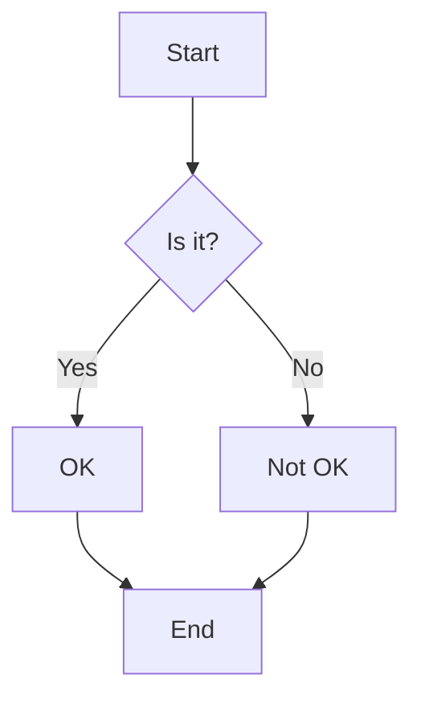

# Welcome to my first blog post!

This is some *sample* content for my blog.

Here's a list:
- Item 1
- Item 2
- Item 3

And here's a code block to test Pygments highlighting:

```python
def hello_world():
    print("Hello, world!")

if __name__ == "__main__":
    hello_world()
```

## Mermaid Diagram

Here is a sample Mermaid diagram:



You can find more information about [Markdown](https://www.markdownguide.org/) here.

This is the end of the post.