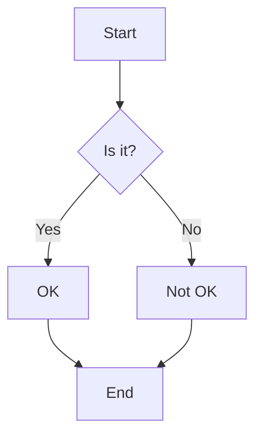

# SPOTAC

How to select you collaborator? This is a useful framework. Never hire and avoid collaborating with people withouth the following personality traits:

- Smart
- Passionate
- Optimistic
- Tenacious
- Adatable
- Kind


# Welcome to my second blog post!

This is some *sample* content for my blog.

Here's a list:
- Item 1
- Item 2
- Item 3

And here's a code block to test Pygments highlighting:

```json
{
  "id":"some_hash",
  "dt":"some dates"
}

```

## Mermaid Diagram

Here is a sample Mermaid diagram:



## Sample Local Image

Here's a local image to test:


You can find more information about [Markdown](https://www.markdownguide.org/) here.

This is the end of the post.
